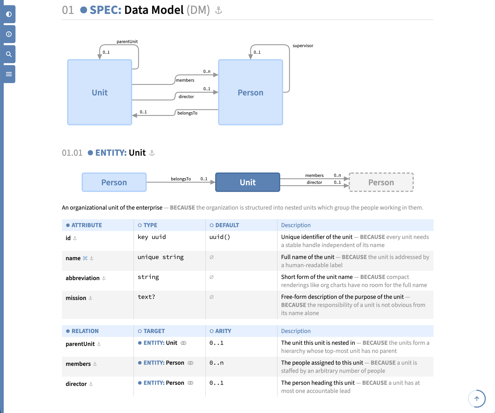
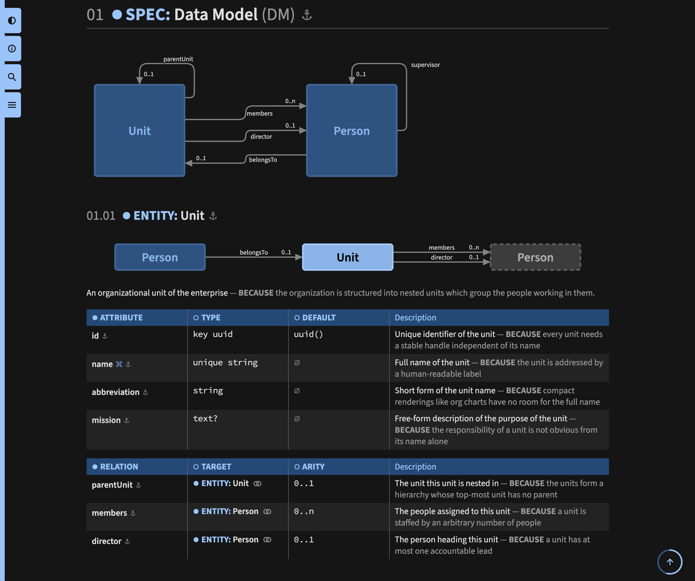
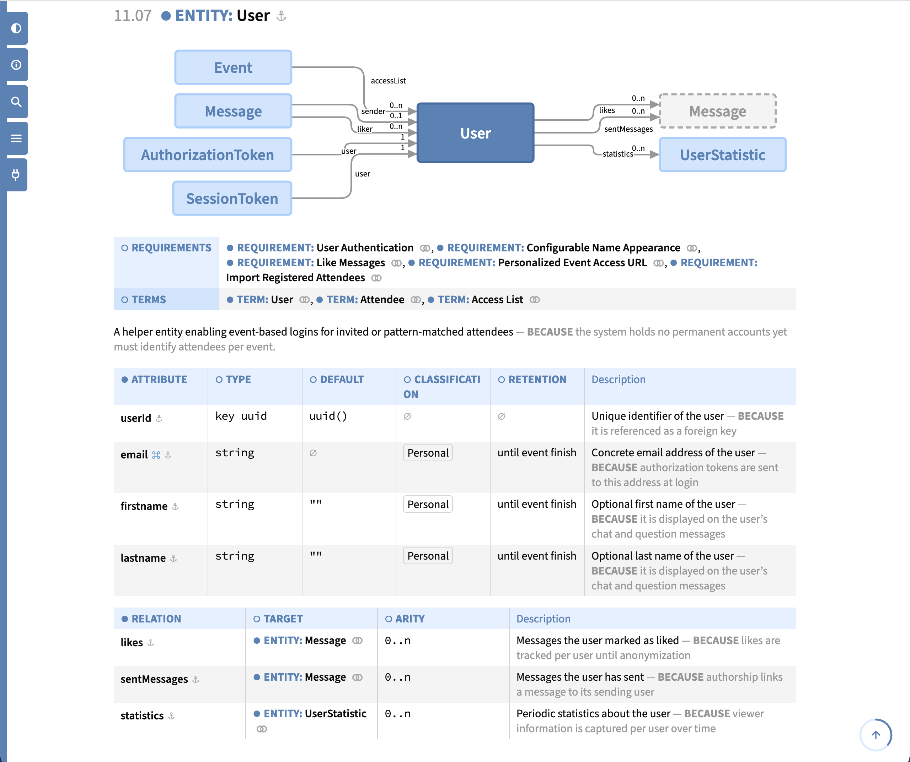
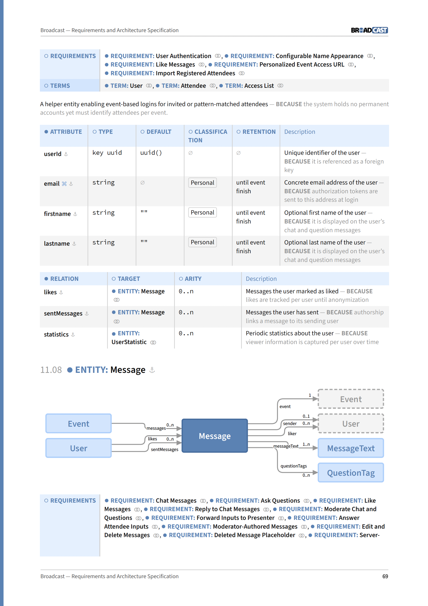

SpecBook
========

**Markdown-based Specification Format**

[](https://github.com/rse)
[](https://github.com/rse)

About
-----

**SpecBook** defines a generic, Markdown-based *specification
format* which can be configured for the specifications of particular
contexts through a YAML-based *schema configuration*. SpecBook allows
specifications to be *initialized*, *linted*, *exported* (JSON, JSON5,
YAML, TOON, HTML, PDF, and normalized Markdown), *previewed* (HTML, live
in the browser), and *described* to LLMs.

**SpecBook** ships with an API class with methods `<xxx>()`, a
CLI with commands `specbook <xxx>`, and an MCP service with tools
`specbook_<xxx>()`.

**SpecBook** provides the following distinct features:

-   **Hierarchical Object Model**:
    A specification is a tree of typed objects, each with a kind and
    name, an optional id, optional properties, optional description, and
    optional child objects. The allowed object hierarchy is defined per
    context by the YAML schema configuration.

-   **Versatile Object to Markdown Mapping**:
    Objects are authored as plain Markdown headings, property lists,
    and description prose. The objects can be mapped to nested sections
    ("complex" format) or compact bullet point lists ("concise" and
    "group" format).

-   **Wiki-Style Object Linking**:
    Objects can hierarchically reference each other through Wiki-style
    `[[xxx]]` references, which are resolved against the locally-unique
    ids and names of all objects. In the HTML and PDF exports they become
    navigable links onto precise anchors.

-   **Strict Validation with Custom Schema**:
    The YAML schema configuration strictly defines the allowed object
    kinds, hierarchies, and properties, whose values are constrained by an
    expression language (regex, enum, tags, list, and reference). Beyond the
    plain values, it constrains the uniqueness and presence of a property
    among the sibling objects and the shape of a reference-valued property
    (local, symmetric, and/or acyclic), and it can declare the child objects
    of an object kind a finite state machine, whose reachability, dead-ends,
    and livelocks are then checked. Violations are reported as file- and
    line-precise diagnostics, while the reference coverage an object kind
    demands is reported as a warning only. A bundled standard schema
    configuration applies if no particular one is given.

-   **Object Model Diagram Visualisation**:
    Object kinds can declare "graph", "hub", or "grid" diagrams in the
    schema, whose nodes and edges are automatically derived from the
    object model and its references. The diagrams are rendered with the
    sibling project [Gradia](https://github.com/rse/gradia), which is
    specialized in rendering object models.

-   **CLI, MCP, and API Interface**:
    All commands are implemented once in the API class `SpecBook`, on
    which both the CLI and the MCP service are just thin wrappers.
    This way, humans, scripts, and AI agents use exactly the same
    functionality.

-   **AST Exports for AI/LLMs**:
    The parsed specification Abstract Syntax Tree (AST) can be exported in
    JSON, JSON5, YAML, or TOON format for machine consumption, with the
    derived diagram of an object attached to it as a textual Gradia spec.
    Together with the `describe` command, which explains the models and
    formats, this enables LLMs to both read and write specifications.

-   **HTML Export for Developers**:
    The HTML export is a self-contained single document with a title page,
    a table-of-contents (also as a slide-in side panel for quick navigation),
    a diagram-of-contents, a fuzzy full-text search, embedded images, a
    scroll progress meter (which also scrolls back to the top on click),
    description popups (which show the schema and corpus description of
    an object kind, property, or object instance on hover), and a
    light/dark theme toggle. It is intended for the day-to-day online
    reading during development. The HTML export can map all object kinds
    to nested sections or compact tables, or an automatic mixture which
    collapses only the deepest level into tables. The HTML export even can
    be previewed in the browser with live updates.

-   **PDF Export for Customers**:
    The PDF export prints the HTML rendering via Chromium and post-processes
    it with page numbers, headers/footers, a brand bar, and a hierarchical
    PDF outline. The paper size (A4, Letter, or Legal) drives the pagination
    and scales the diagrams down to fit onto a single page. It is intended
    as a polished, paginated offline document for handing over to customers.

-   **Document Theming and Typography**:
    The title object of the specification drives the entire document:
    its title, subtitle, author, version, and logo fill the title page
    (with an optional light/dark variant of the logo), its language
    selects the smart typography quote style, its color tone seeds the
    theme color spreads of both the light and the dark theme, and its
    character set subsets the embedded fonts down to the actually needed
    glyphs.

Overview
--------

[](etc/poster-1.pdf)

[](etc/poster-2.pdf)

Installation
------------

```bash
$ npm install -g @rse/specbook
```

Usage
-----

### CLI

Commands:

```bash
$ specbook init \
  [-v|--verbose] \
  [-c|--config <schema-yaml-file>] \
  [-b|--basedir <spec-md-file-basedir>]

$ specbook lint \
  [-v|--verbose] \
  [-c|--config <schema-yaml-file>] \
  [-b|--basedir <spec-md-file-basedir>]

$ specbook export \
  [-v|--verbose] \
  [-c|--config <schema-yaml-file>] \
  [-b|--basedir <spec-md-file-basedir>] \
  [-o|--output [<format>:]<output-file>] \
  [-w|--watch] \
  [...]

$ specbook preview \
  [-v|--verbose] \
  [-c|--config <schema-yaml-file>] \
  [-b|--basedir <spec-md-file-basedir>] \
  [-a|--addr <ip-addr>] \
  [-p|--port <tcp-port>]

$ specbook describe \
  [-v|--verbose] \
  [-c|--config <schema-yaml-file>] \
  [-b|--basedir <spec-md-file-basedir>] \
  [-e|--embed] \
  [-z|--compress [<level>]] \
  [-f|--format <format>] \
  [-p|--part <part>] \
  [-o|--output <output-file>]

$ specbook mcp \
  [-v|--verbose]
```

Options:

-   `-v|--verbose`:
    Enable verbose logging of processing information to `stderr`.

-   `-c|--config <schema-yaml-file>`:
    The YAML schema configuration (default: the bundled standard schema
    configuration `specbook-format.yaml`) determines the specification:
    exactly the artifact files its `file` fields reference are loaded and
    parsed; all other Markdown files below the base directory are ignored.
    A referenced file which is absent is reported, unless all of its
    artifacts are `optional`, and so is an artifact absent from its present
    file, unless it is `optional` itself. Both `lint` and `export` report
    all diagnostics and fail on any error among them (a warning, like a
    lapse of the reference coverage a `referenced` object kind demands,
    is reported only), so a partial or invalid specification is never
    exported.
    The option accepts glob patterns and can be given multiple times: the
    matching files (in the order of the patterns and alphabetically within
    a pattern, where the literal `std` names the bundled standard schema
    configuration, and where a pattern matching no file is an error) are
    merged in order into one effective schema configuration, the later
    files into the earlier ones. The objects merge deeply, while the
    elements of the lists are matched by identity (artifacts by `kind`
    plus `id`/`name`, nested objects by `kind`, properties by `name`, and
    scalar entries by value): a matching element is merged into its
    counterpart, an unmatched one is appended. Every file has to be valid
    YAML on its own, while the merged result alone is validated against
    the schema of the configuration.

-   `-b|--basedir <spec-md-file-basedir>`:
    The base directory (default: `.`) is the directory the referenced
    artifact files are resolved against, and generated specification
    Markdown files are placed inside it, too.

-   `-o|--output [<format>:]<output-file>` (`export` only):
    The output file (default: `-` for stdout) can be given multiple times.
    The format (`json`, `json5`, `yaml`, `toon`, `html`, `pdf`, or `md`)
    is inferred from the filename extension, unless it is explicitly given
    as a `<format>:` prefix, and plain `-` (stdout) defaults to JSON.
    The `md` export format normalizes the entire corpus into a *single*
    Markdown document.

-   `-w|--watch` (`export` only):
    Keep the outputs in sync with their sources: after the regular export,
    the YAML schema configuration files, the referenced artifact files, and
    all assets they embed are observed, and every change re-exports the
    specification once the sources stayed silent for one second. A failed
    re-export is reported and leaves the observe loop intact, so a
    transiently invalid specification (or configuration) does not end the
    watch. The outputs have to be regular files, as `-` (stdout) cannot
    receive a repeated export, and none of them may be an observed source
    file itself, as its own write would re-trigger the observation
    endlessly.

-   `-a|--addr <ip-addr>`, `-p|--port <tcp-port>` (`preview` only):
    The IP address (default: `127.0.0.1`) and TCP port (default: `12345`)
    the live preview listens on. The HTML export is served on
    `http://<ip-addr>:<tcp-port>/`, kept in sync with its sources exactly
    like `export --watch`, and updated in the browser after every change
    through a WebSocket connection the served page keeps open, where the
    document is replaced in place, so the scroll position and the theme
    choice survive (a failed re-export keeps the previous HTML in place,
    and a request before the first successful export is answered with a
    placeholder page which replaces itself with the document once that
    export arrives). A status tab at the bottom of the brand bar shows
    the connection state: its plug icon carries the search highlight
    color while disconnected and blinks for 2s after every update.

-   `-o|--output <output-file>` (`describe` only):
    The output file (default: `-` for stdout) receives the described
    Markdown document.

-   `-e|--embed` (`describe` only):
    Embed the given YAML schema configuration itself instead of just
    referencing it, so the resulting document describes the specification
    format entirely on its own.

-   `-z|--compress [<level>]` (`describe` only):
    The compression level (default and bare flag: `1`) of the YAML
    schema configuration (embedded into the Markdown or emitted as the
    raw file content), so the configuration costs fewer tokens: `0`
    emits it verbatim, `1` re-emits it with 2-space indentation, unwrapped
    lines, and without comments, `2` additionally leaves out its `refs` fields, and
    `3` additionally leaves out its `desc` fields of objects and properties.

-   `-f|--format <format>` (`describe` only):
    The output format (default: `md`) switches from the rendered Markdown
    onto the raw original file content (the `schema` one compressed by the
    `-z|--compress` level) with `raw`, which is available for
    the file-backed parts `meta` and `schema` only.

-   `-p|--part <part>` (`describe` only):
    The document part (default: `all`) reduces the output to a single part:
    `meta` for the description of the generic SpecBook models and formats,
    `schema` for the YAML schema configuration (the given one, referenced
    or embedded with `-e|--embed`, else the bundled standard one,
    embedded), or `spec` for the reference to the base directory.

The default value of every CLI option `--xxx` can be overridden
by a corresponding `SPECBOOK_XXX` environment variable (e.g.
`SPECBOOK_BASEDIR`, `SPECBOOK_CONFIG`, `SPECBOOK_OUTPUT`,
`SPECBOOK_VERBOSE`, `SPECBOOK_ADDR`, `SPECBOOK_PORT`), while an
explicitly supplied option always wins. As `-c|--config` is repeatable,
`SPECBOOK_CONFIG` carries a list of patterns separated by the path
delimiter of the platform (`:` on Unix, `;` on Windows).

Beyond those, the option-less `SPECBOOK_BROWSER` selects the browser
printing the PDF export: a value carrying a path separator is taken as
an executable path and any other one as a Playwright channel name
(`chromium`, `chromium-headless-shell`, `chrome`, `chrome-beta`,
`chrome-dev`, `chrome-canary`, `msedge`, `msedge-beta`, `msedge-dev`,
or `msedge-canary`). The variable itself has no default value: when it
is unset, the downloaded Playwright Chromium is used (the equivalent of
`chromium`) and only if that one is absent a system-installed *Google
Chrome* (the equivalent of `chrome`). An explicitly configured browser
failing to launch fails the export instead of falling back onto another
browser.

Example: Simple
---------------

Check out the *simple* specification of simple
example data model:

### Sources

-   [Specification](smp/sample/sample.md)
-   [Schema](smp/sample/sample.yaml)

### Generation

```bash
$ specbook lint -v \
    -b smp/sample \
    -o smp/sample/sample.html \
    -o smp/sample/sample.pdf
```

### HTML Rendering




Example: Complex
----------------

Check out the *complex* specification of the Broadcast
application, based on **SpecBook**'s built-in "standard" schema:

### Sources

-   [Specification](smp/broadcast/)
-   [Schema](src/specbook-format.d/)

### Generation

```bash
$ specbook lint -v \
    -b smp/broadcast \
    -o smp/broadcast/broadcast.html \
    -o smp/broadcast/broadcast.pdf
```

### HTML Rendering




### PDF Rendering



See Also
--------

- [Gradia](https://github.com/rse/gradia)
- [ASE](https://ase.tools)

Support
-------

**SpecBook** is developed in the experience context of industrial Software
Engineering at the [*msg group*](https://www.msg.group) and in the
educational context of the *Software Engineering Academy (SEA)*. **SpecBook**
development is supported by *msg Research* and *Software Engineering
Academy (SEA)*.

License
-------

Copyright &copy; 2026 [Dr. Ralf S. Engelschall](http://engelschall.com/)<br/>
Licensed under [Apache 2.0](https://spdx.org/licenses/Apache-2.0)

