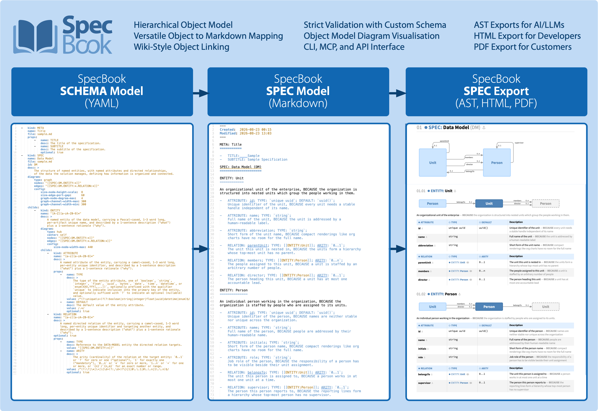
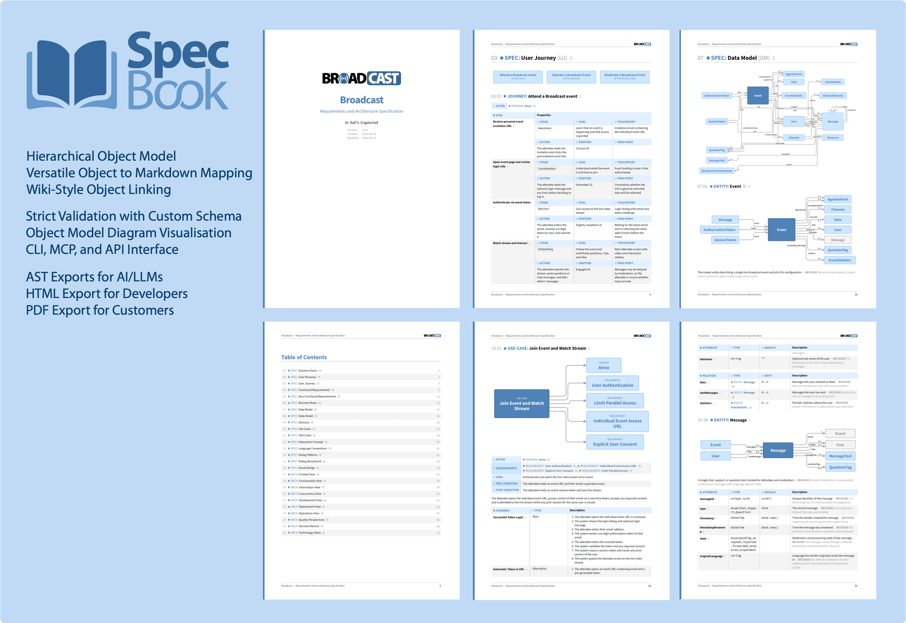
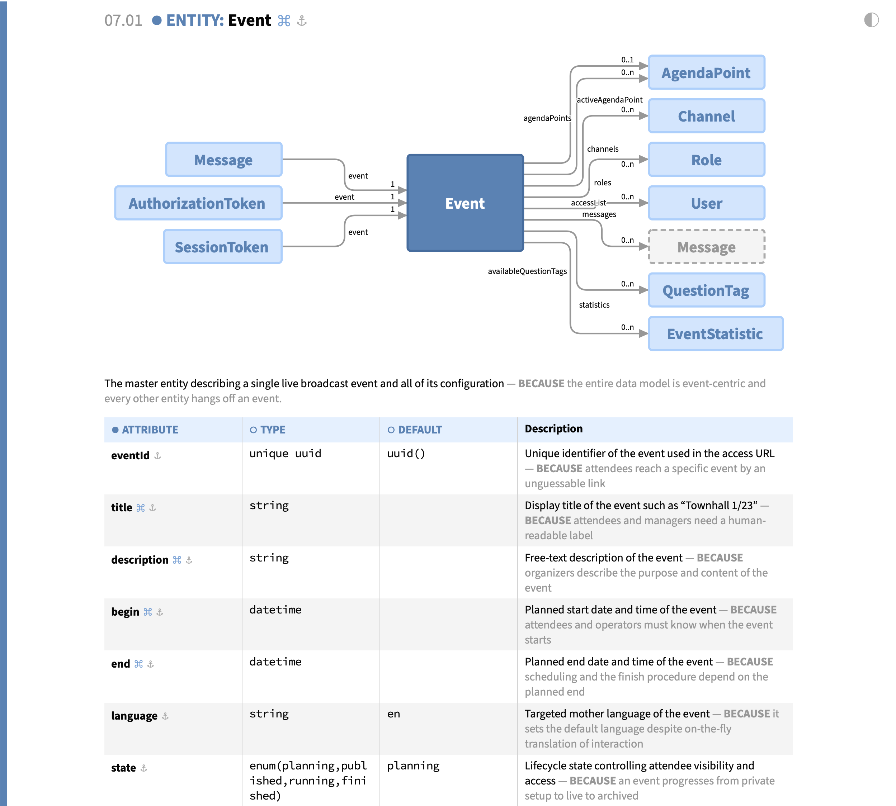
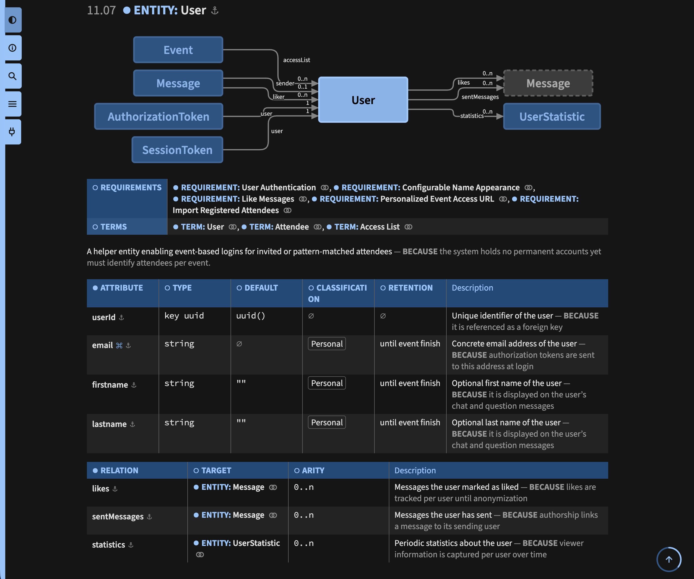
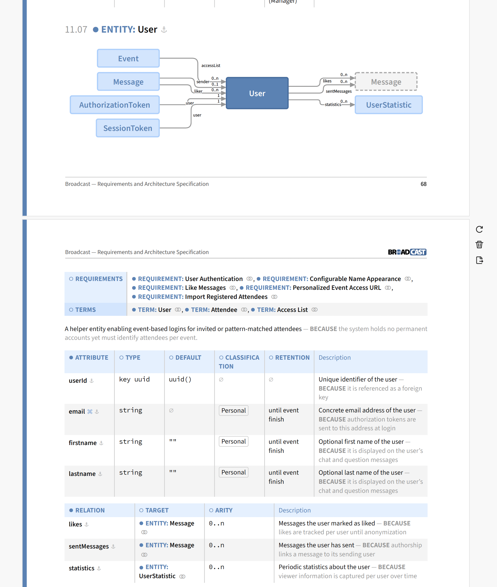

SpecBook
========

**Markdown-based Specification Format**

About
-----

**SpecBook** defines a generic, Markdown-based *specification
format* which can be configured for the specifications of particular
contexts through a YAML-based *schema configuration*. SpecBook allows
specifications to be *initialized*, *linted*, *exported* (JSON, JSON5,
YAML, TOON, HTML, PDF, and normalized Markdown), *previewed* (HTML, live
in the browser), and *described* to LLMs.

**SpecBook** ships with an API class with methods `<xxx>()`, a
CLI with commands `specbook <xxx>`, and an MCP service with tools
`specbook_<xxx>()`.

**SpecBook** provides the following distinct features:

-   **Hierarchical Object Model**:
    A specification is a tree of typed objects, each with a kind and
    name, an optional id, optional properties, optional description, and
    optional child objects. The allowed object hierarchy is defined per
    context by the YAML schema configuration.

-   **Versatile Object to Markdown Mapping**:
    Objects are authored as plain Markdown headings, property lists,
    and description prose. The objects can be mapped to nested sections
    ("complex" format) or compact bullet point lists ("concise" and
    "group" format).

-   **Wiki-Style Object Linking**:
    Objects can hierarchically reference each other through Wiki-style
    `[[xxx]]` references, which are resolved against the locally-unique
    ids and names of all objects. In the HTML and PDF exports they become
    navigable links onto precise anchors.

-   **Strict Validation with Custom Schema**:
    The YAML schema configuration strictly defines the allowed object
    kinds, hierarchies, and properties, whose values are constrained by an
    expression language (regex, enum, tags, list, and reference). Violations
    are reported as file- and line-precise diagnostics. A bundled standard
    schema configuration applies if no particular one is given.

-   **Object Model Diagram Visualisation**:
    Object kinds can declare "graph", "hub", or "grid" diagrams in the
    schema, whose nodes and edges are automatically derived from the
    object model and its references. The diagrams are rendered with the
    sibling project [Gradia](https://github.com/rse/gradia), which is
    specialized in rendering object models.

-   **CLI, MCP, and API Interface**:
    All commands are implemented once in the API class `SpecBook`, on
    which both the CLI and the MCP service are just thin wrappers.
    This way, humans, scripts, and AI agents use exactly the same
    functionality.

-   **AST Exports for AI/LLMs**:
    The parsed specification Abstract Syntax Tree (AST) can be exported in
    JSON, JSON5, YAML, or TOON format for machine consumption. Together
    with the `describe` command, which explains the models and formats,
    this enables LLMs to both read and write specifications.

-   **HTML Export for Developers**:
    The HTML export is a self-contained single document with a
    table-of-contents, full-text search, embedded images, and a light/dark
    theme toggle. It is intended for the day-to-day online reading during
    development. The HTML export can map all object kinds to nested
    sections or compact tables, or an automatic mixture which collapses
    only the deepest level into tables.

-   **PDF Export for Customers**:
    The PDF export prints the HTML rendering via Chromium and post-processes
    it with page numbers, headers/footers, and a hierarchical PDF outline.
    It is intended as a polished, paginated offline document for handing
    over to customers.

Overview
--------

[](etc/poster-1.pdf)

[](etc/poster-2.pdf)

Installation
------------

```bash
$ npm install -g @rse/specbook
```

Usage
-----

### API

```ts
/*  the SpecBook API, providing all commands the CLI and MCP service expose  */
export class SpecBook {
    constructor (options?: SpecBookOptions)

    /*  initialize the configured specification artifact files below the
        base directory and return the list of the generated files  */
    init (options: {
        config?:  string,          /*  YAML schema configuration (default: bundled standard one)  */
        basedir?: string           /*  base directory (default: ".")  */
    }): Promise<string[]>

    /*  parse and validate the specification Markdown files below the base directory  */
    lint (options: {
        config?:  string,
        basedir?: string
    }): Promise<LintResult>

    /*  export the specification, parsing the input just once and
        returning one buffer per requested format (strict: any diagnostic
        rejects the export with an "Error")  */
    export (options: {
        config?:  string,
        basedir?: string,
        formats?: ExportFormat[],  /*  requested output formats (default: [ "json" ])  */
        realtime?: boolean         /*  inject the live preview script into the HTML  */
    }): Promise<Buffer[]>

    /*  export the specification like "export" and then keep it in sync by
        re-exporting it on every change of a specification file (a failed
        re-export is reported and leaves the observe loop intact)  */
    watch (options: {
        config?:  string,
        basedir?: string,
        formats?: ExportFormat[],
        realtime?: boolean,
        onExport: (buffers: Buffer[]) => void | Promise<void>
    }): Promise<void>

    /*  serve the HTML export as a live preview on "http://<addr>:<port>/",
        kept in sync like "watch" and updated in the browser on every change  */
    preview (options: {
        config?:  string,
        basedir?: string,
        addr?:    string,          /*  listening IP address (default: "127.0.0.1")  */
        port?:    number           /*  listening TCP port (default: 12345)  */
    }): Promise<void>

    /*  describe the SpecBook models and formats, optionally pointing to
        the artifacts of the particular project  */
    describe (options: {
        config?:  string,
        basedir?: string,
        embed?:   boolean,         /*  embed the schema configuration instead of referencing it  */
        format?:  DescribeFormat,  /*  output format (default: "md")  */
        part?:    DescribePart     /*  document part (default: "all")  */
    }): Promise<string>
}

/*  the constructor options and the sink of the verbose messages,
    receiving the emitting command and the message  */
export interface SpecBookOptions {
    verbose?:      VerboseSink
}
export type VerboseSink = (cmd: string, msg: string) => void

/*  the result of the "lint" command and its file- and line-precise diagnostics  */
export interface LintResult {
    specification: Spec
    diagnostics:   Diagnostic[]
    config?:       Schema
    files:         string[]    /*  the artifact files plus their embedded assets  */
}
export interface Diagnostic {
    file:          string
    line:          number
    column:        number
    message:       string
}

/*  the supported export formats and describe formats/parts  */
export const formats:         readonly [ "json", "json5", "yaml", "toon", "html", "pdf", "md" ]
export const describeFormats: readonly [ "md", "raw" ]
export const describeParts:   readonly [ "all", "meta", "schema", "spec" ]
export type  ExportFormat   = typeof formats[number]
export type  DescribeFormat = typeof describeFormats[number]
export type  DescribePart   = typeof describeParts[number]

/*  the Abstract Syntax Tree (AST) of a parsed specification  */
export type Spec = {
    artifacts:     SpecArtifact[]
}
export type SpecArtifact = {
    created:       Date
    modified:      Date
    objects:       SpecObject[]
}
export type SpecObject = {
    kind:          string
    id:            string
    anchor?:       string
    paren?:        string
    name:          string
    primary?:      boolean
    description?:  SpecDescription
    properties:    SpecProperty[]
    childs:        SpecObject[]
}
export type SpecDescription = {
    description:   string
    rationale?:    string
    embedding?:    string[]
}
export type SpecProperty = {
    key:           string
    value:         string
    embedding?:    string[]
}

/*  the YAML schema configuration, where the nested "diagram" and
    "format" structures are detailed in the "describe" output  */
export type Schema = SchemaObject[]
export type SchemaObject = {
    kind:          string
    name?:         string
    id?:           string
    file?:         string
    desc?:         string
    optional?:     boolean
    diagram?:      SchemaDiagram
    format?:       SchemaFormat
    props?:        SchemaProperty[]
    childs?:       SchemaObject[]
}
export type SchemaProperty = {
    name:          string
    desc?:         string
    value?:        string
    optional?:     boolean
}
```

Example:

```ts
import { SpecBook } from "@rse/specbook"

const specbook = new SpecBook({
    verbose: (cmd, msg) => console.error(`specbook: ${cmd}: ${msg}`)
})
const result = await specbook.lint({
    basedir: "smp/broadcast"
})
```

### CLI

Commands:

```bash
$ specbook init \
  [-v|--verbose] \
  [-c|--config <schema-yaml-file>] \
  [-b|--basedir <spec-md-file-basedir>]

$ specbook lint \
  [-v|--verbose] \
  [-c|--config <schema-yaml-file>] \
  [-b|--basedir <spec-md-file-basedir>]

$ specbook export \
  [-v|--verbose] \
  [-c|--config <schema-yaml-file>] \
  [-b|--basedir <spec-md-file-basedir>] \
  [-o|--output [<format>:]<output-file>] \
  [-w|--watch] \
  [...]

$ specbook preview \
  [-v|--verbose] \
  [-c|--config <schema-yaml-file>] \
  [-b|--basedir <spec-md-file-basedir>] \
  [-a|--addr <ip-addr>] \
  [-p|--port <tcp-port>]

$ specbook describe \
  [-v|--verbose] \
  [-c|--config <schema-yaml-file>] \
  [-b|--basedir <spec-md-file-basedir>] \
  [-e|--embed] \
  [-f|--format <format>] \
  [-p|--part <part>] \
  [-o|--output <output-file>]

$ specbook mcp \
  [-v|--verbose]
```

Options:

-   `-v|--verbose`:
    Enable verbose logging of processing information to `stderr`.

-   `-c|--config <schema-yaml-file>`:
    The YAML schema configuration (default: the bundled standard schema
    configuration `specbook-format.yaml`) determines the specification:
    exactly the artifact files its `file` fields reference are loaded and
    parsed; all other Markdown files below the base directory are ignored.
    A referenced file which is absent is reported, unless all of its
    artifacts are `optional`, and so is an artifact absent from its present
    file, unless it is `optional` itself. Both `lint` and `export` report
    all diagnostics and fail on any of them, so a partial or invalid
    specification is never exported.

-   `-b|--basedir <spec-md-file-basedir>`:
    The base directory (default: `.`) is the directory the referenced
    artifact files are resolved against, and generated specification
    Markdown files are placed inside it, too.

-   `-o|--output [<format>:]<output-file>` (`export` only):
    The output file (default: `-` for stdout) can be given multiple times.
    The format (`json`, `json5`, `yaml`, `toon`, `html`, `pdf`, or `md`)
    is inferred from the filename extension, unless it is explicitly given
    as a `<format>:` prefix, and plain `-` (stdout) defaults to JSON.
    The `md` export format normalizes the entire corpus into a *single*
    Markdown document.

-   `-w|--watch` (`export` only):
    Keep the outputs in sync with their sources: after the regular export,
    the referenced artifact files and all assets they embed are observed,
    and every change re-exports the specification once the sources stayed
    silent for one second. A failed re-export is reported and leaves the
    observe loop intact, so a transiently invalid specification does not
    end the watch. The outputs have to be regular files, as `-` (stdout)
    cannot receive a repeated export.

-   `-a|--addr <ip-addr>`, `-p|--port <tcp-port>` (`preview` only):
    The IP address (default: `127.0.0.1`) and TCP port (default: `12345`)
    the live preview listens on. The HTML export is served on
    `http://<ip-addr>:<tcp-port>/`, kept in sync with its sources exactly
    like `export --watch`, and updated in the browser after every change
    through a WebSocket connection the served page keeps open, where the
    document is replaced in place, so the scroll position survives (a
    failed re-export keeps the previous HTML in place). A status icon
    left of the theme switcher shows the connection state: grey while
    connected, in the search highlight color while disconnected, and
    blinking for 2s after every update.

-   `-o|--output <output-file>` (`describe` only):
    The output file (default: `-` for stdout) receives the described
    Markdown document.

-   `-e|--embed` (`describe` only):
    Embed the given YAML schema configuration verbatim instead of just
    referencing it, so the resulting document describes the specification
    format entirely on its own.

-   `-f|--format <format>` (`describe` only):
    The output format (default: `md`) switches from the rendered Markdown
    onto the raw original file content with `raw`, which is available for
    the file-backed parts `meta` and `schema` only.

-   `-p|--part <part>` (`describe` only):
    The document part (default: `all`) reduces the output to a single part:
    `meta` for the description of the generic SpecBook models and formats,
    `schema` for the YAML schema configuration (the given one, referenced
    or embedded with `-e|--embed`, else the bundled standard one,
    embedded), or `spec` for the reference to the base directory.

The default value of every CLI option `--xxx` can be overridden
by a corresponding `SPECBOOK_XXX` environment variable (e.g.
`SPECBOOK_BASEDIR`, `SPECBOOK_CONFIG`, `SPECBOOK_OUTPUT`,
`SPECBOOK_VERBOSE`, `SPECBOOK_ADDR`, `SPECBOOK_PORT`), while an
explicitly supplied option always wins.

Example:

```bash
$ specbook lint -v -b smp/broadcast
```

Rendering Examples
------------------

### HTML Rendering (Light Theme)



### HTML Rendering (Dark Theme)



### PDF Rendering



License
-------

Copyright &copy; 2026 [Dr. Ralf S. Engelschall](http://engelschall.com/)<br/>
Licensed under [Apache 2.0](https://spdx.org/licenses/Apache-2.0)

