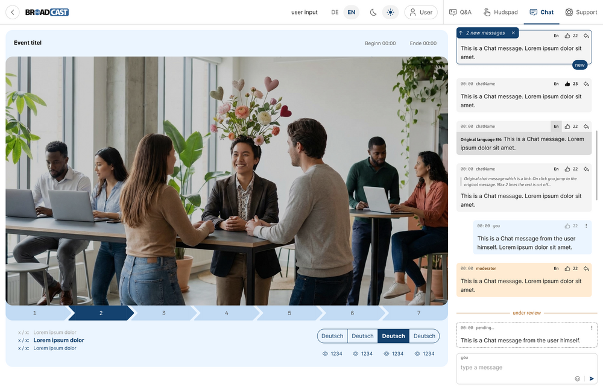
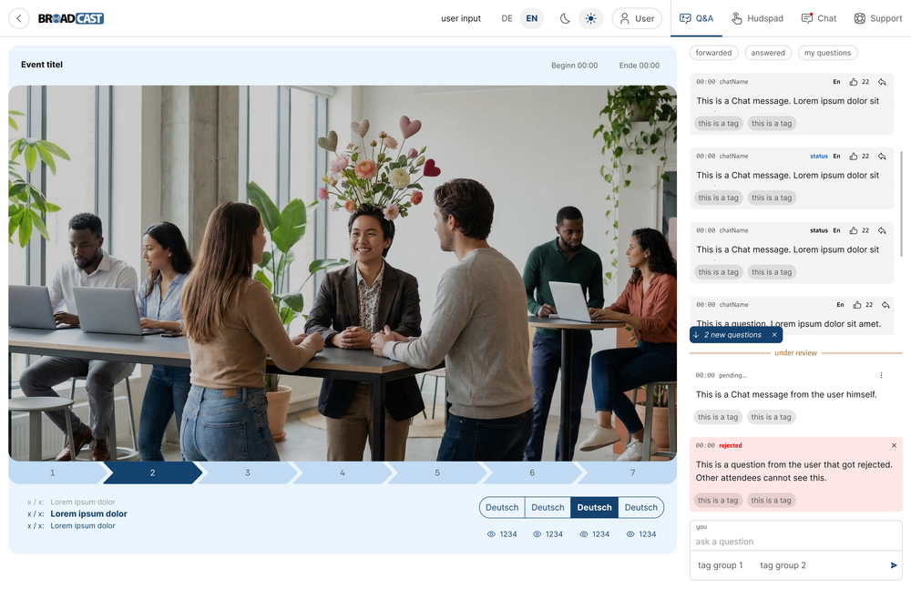
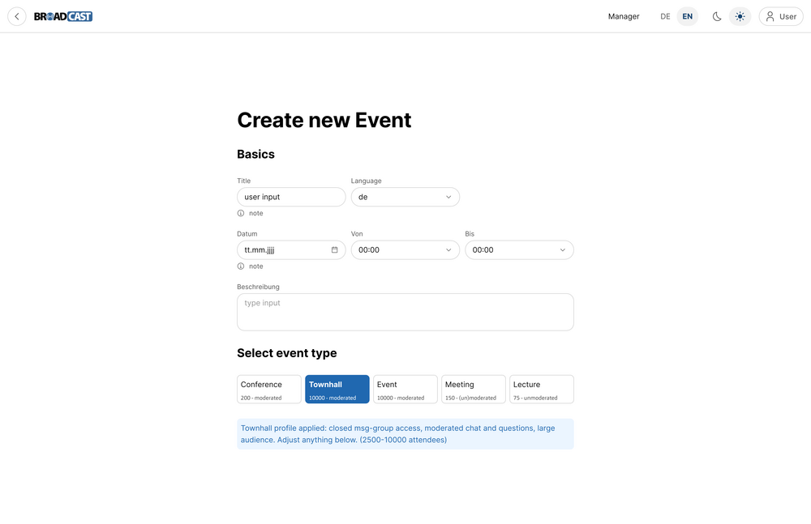
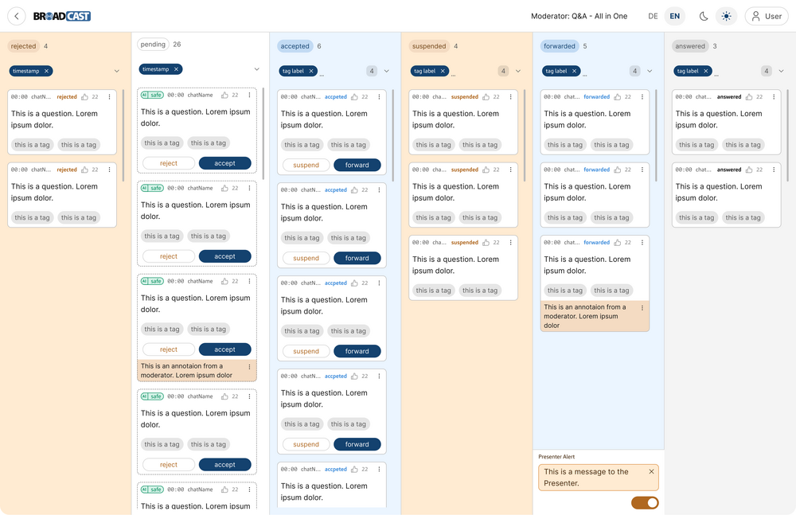

#   SPEC: Visual Design (VD)

##  ELEMENT: Brand Color Palette {{color-palette}}

-   CATEGORY: Color

The interface uses the msg corporate palette with a primary msg blue
for actions, the active channel, and own outgoing messages, neutral
surfaces for others' messages, a warm amber tint for moderator-authored
messages and the "under review" state, and muted italic styling for
deleted messages, BECAUSE color-coded message provenance and state give
attendees and moderators instant visual feedback.

##  ELEMENT: Light and Dark Theme {{theme}}

-   CATEGORY: Color

The application provides both a light and a dark theme, toggled from a
sun/moon control in the header bar and applied consistently across video
frame, sidebar, and message bubbles, BECAUSE attendees view events in
varied lighting and expect to choose a comfortable appearance.

##  ELEMENT: Broadcast Wordmark {{wordmark}}

-   CATEGORY: Imagery

The product is represented by the "BROADCAST" wordmark with the circled
"O" accent in msg blue, placed top-left in the header bar, BECAUSE a
distinctive, consistently placed wordmark anchors the brand on every
screen.

##  ELEMENT: TypoPRO Typography {{typography}}

-   CATEGORY: Typography

Text is set in a self-hosted TypoPRO web font family with a clear type
scale for headings, body, and captions, sized for legibility on the
studio screen at 2-4 meters viewing distance, BECAUSE self-hosted fonts
avoid third-party requests and the studio view must remain readable from
afar.

##  ELEMENT: Fontawesome Iconography {{iconography}}

-   CATEGORY: Iconography

Actions and message states are reinforced with a consistent Fontawesome
icon set, pairing icons with text labels for moderation controls,
BECAUSE consistent icons speed recognition of repeated moderation
actions.

##  ELEMENT: Responsive Layout Grid {{layout}}

-   CATEGORY: Layout

The attendee layout uses a Tailwind-based responsive grid with a top
header bar above a two-column body that places the video and event
header on the left and a tabbed interaction sidebar (Q&A, Hudspad, Chat,
Support) on the right, collapsing to a stacked single column on mobile
landscape and portrait, BECAUSE the same content must adapt across the
device classes attendees use.

##  ELEMENT: Stream Imagery Treatment {{imagery}}

-   CATEGORY: Imagery

The live video occupies a prominent 16:9 frame with a neutral letterbox
and a subtle channel and language badge overlay, BECAUSE the stream
is the focal content and attendees must see which channel they are
watching.

##  ELEMENT: Subtle State Transitions {{animation}}

-   CATEGORY: Animation

State and configuration changes animate with short, subtle transitions
under 200ms, including the seamless cross-fade on a stream provider
switch, BECAUSE gentle motion signals live updates without distracting
from the event.
