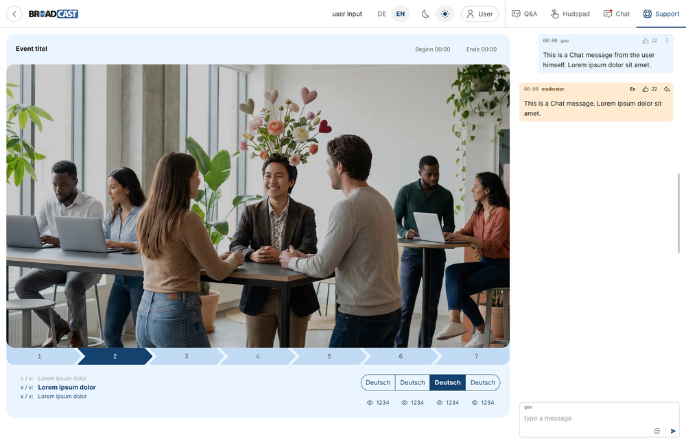
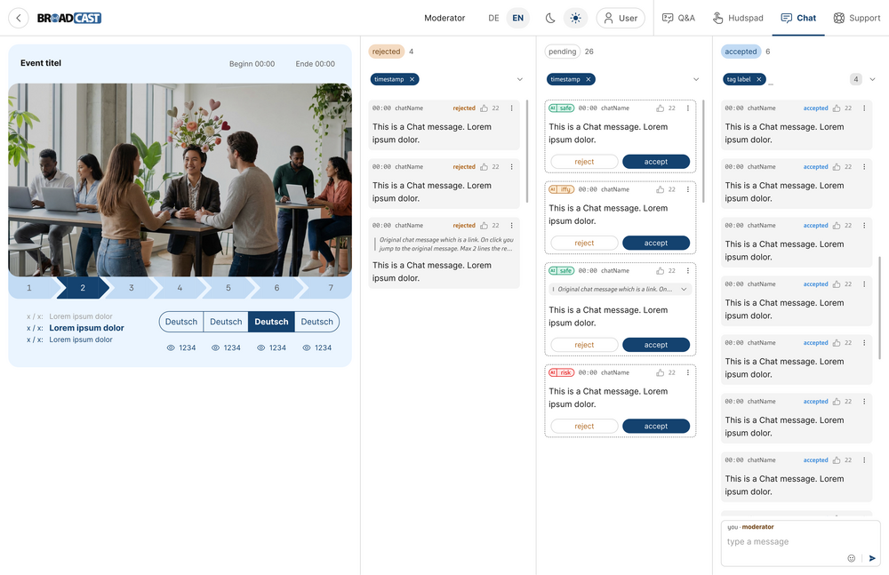
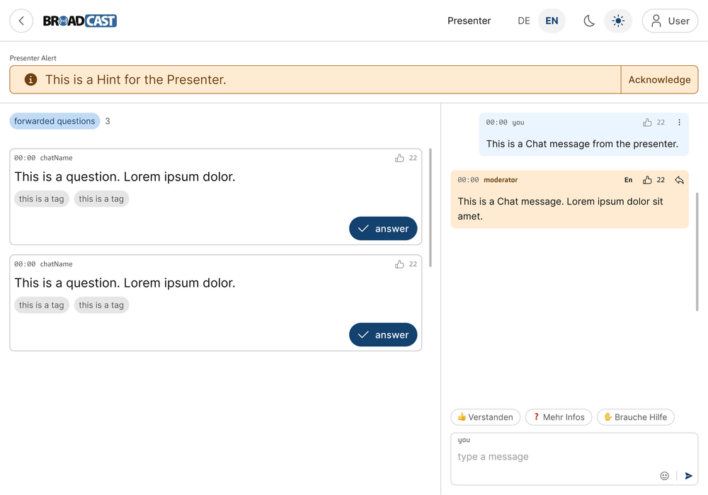

#   UXUI: Visual Design (VD)

##  ELEMENT: Brand Color Palette {{color-palette}}

-   CATEGORY: Color
-   PRINCIPLES: [[PRINCIPLE:moderation-gated]], [[PRINCIPLE:privacy-identity]]
-   SOURCE: Tailwind theme configuration of the frontend (`tailwind.config.ts`), color section
-   TRADE-OFF: A palette bound to the corporate identity, leaving no room for event-specific branding.

The interface uses the msg corporate palette with a primary msg blue
for actions, the active channel, and own outgoing messages, neutral
surfaces for others' messages, a warm amber tint for moderator-authored
messages and the "under review" state, a red tint for rejected input,
and muted italic styling for deleted messages, BECAUSE color-coded
message provenance and state give attendees and moderators instant
visual feedback.

##  ELEMENT: Light and Dark Theme {{theme}}

-   CATEGORY: Color
-   PRINCIPLES: [[PRINCIPLE:familiar-conventions]]
-   SOURCE: Tailwind theme configuration of the frontend (`tailwind.config.ts`), dark mode section
-   TRADE-OFF: Every semantic color role has to be defined and checked twice, once per theme.

The application provides both a light and a dark theme, toggled from a
sun/moon control in the header bar and applied consistently across video
frame, sidebar, and message bubbles, BECAUSE attendees view events in
varied lighting and expect to choose a comfortable appearance.

##  ELEMENT: Broadcast Wordmark {{wordmark}}

-   CATEGORY: Brand
-   TRADE-OFF: A reserved header strip on every screen, including the space-constrained mobile layouts.

The product is represented by the "BROADCAST" wordmark with the circled
"O" accent in msg blue, placed top-left in the header bar, BECAUSE a
distinctive, consistently placed wordmark anchors the brand on every
screen.

##  ELEMENT: Self-Hosted Typography {{typography}}

-   CATEGORY: Typography
-   ACTORS: [[PERSONA:attendee]], [[PERSONA:presenter]]
-   SOURCE: TypoPRO font package of the frontend (`@typopro/web-*`), subsetted at build time
-   TRADE-OFF: A larger initial download than a system font stack, as the font files ship with the application.

Text is set in a self-hosted TypoPRO web font family with a clear type
scale for headings, body, and captions, sized for legibility on the
studio screen at 2-4 meters viewing distance, BECAUSE self-hosted fonts
avoid third-party requests and the studio view must remain readable from
afar.

##  ELEMENT: Fontawesome Iconography {{iconography}}

-   CATEGORY: Iconography
-   PRINCIPLES: [[PRINCIPLE:familiar-conventions]]
-   SOURCE: Fontawesome Free package of the frontend (`@fortawesome/fontawesome-free`)
-   TRADE-OFF: A vocabulary limited to the coverage of one icon set, so a missing metaphor is worked around with a text label.

Actions and message states are reinforced with a consistent Fontawesome
icon set, pairing icons with text labels for moderation controls,
BECAUSE consistent icons speed recognition of repeated moderation
actions.

##  ELEMENT: Responsive Spacing Scale {{spacing}}

-   CATEGORY: Spacing
-   PRINCIPLES: [[PRINCIPLE:never-leave-stream]]
-   SOURCE: Tailwind theme configuration of the frontend (`tailwind.config.ts`), spacing and screens sections
-   TRADE-OFF: Fixed breakpoints, so a layout jumps between its arrangements instead of scaling fluidly.

Spacing follows the Tailwind 4px-based scale with a 16px base gutter, and
the breakpoints `sm` (640px), `md` (768px), and `lg` (1024px) decide at
which widths the video-with-sidebar arrangement collapses into the
stacked single column, BECAUSE one shared scale keeps the density of
video, sidebar, and boards consistent across the device classes
attendees use.

##  ELEMENT: Card and Bubble Shape {{shape}}

-   CATEGORY: Shape
-   TRADE-OFF: A soft look which relies on subtle tints and hairline borders, demanding a well-tuned contrast in both themes.

Messages, questions, and form fields use rounded rectangles with a 6px
corner radius and a hairline border, moderation cards get a subtle
elevation shadow, and buttons are pill-shaped with the primary action
filled and the secondary action outlined, BECAUSE a uniform shape
language lets the color and iconography carry the meaning of an item.

##  ELEMENT: Stream Imagery Treatment {{imagery}}

-   CATEGORY: Imagery
-   ACTORS: [[PERSONA:attendee]]
-   PRINCIPLES: [[PRINCIPLE:never-leave-stream]]
-   TRADE-OFF: Letterbox bars on screens whose aspect ratio differs from 16:9, wasting some display area.

The live video occupies a prominent 16:9 frame with a neutral letterbox
and a subtle channel and language badge overlay, BECAUSE the stream
is the focal content and attendees must see which channel they are
watching.

##  ELEMENT: Subtle State Transitions {{motion}}

-   CATEGORY: Motion
-   PRINCIPLES: [[PRINCIPLE:live-reactivity]]
-   TRADE-OFF: Transitions short enough to be missed when the user is not looking at the changed region.

State and configuration changes animate with short, subtle transitions
under 200ms, including the seamless cross-fade on a stream provider
switch, BECAUSE gentle motion signals live updates without distracting
from the event.

##  MOCKUP: Attendee Chat View {{mockup-attendee-chat}}

-   ACTORS: [[PERSONA:attendee]]
-   STORYBOARD: [[STORYBOARD:chat-interaction]]
-   ELEMENTS: [[ELEMENT:color-palette]], [[ELEMENT:theme]], [[ELEMENT:wordmark]], [[ELEMENT:typography]], [[ELEMENT:iconography]], [[ELEMENT:spacing]], [[ELEMENT:shape]], [[ELEMENT:imagery]]
-   IMAGE: 

The main attendee screen with the Chat tab open, showing the blue own
message, the amber moderator message, the "under review" divider, and
the new-messages badge above the letterboxed stream.

##  MOCKUP: Attendee Q&A View {{mockup-attendee-qa}}

-   ACTORS: [[PERSONA:attendee]]
-   STORYBOARD: [[STORYBOARD:ask-question]]
-   ELEMENTS: [[ELEMENT:color-palette]], [[ELEMENT:typography]], [[ELEMENT:iconography]], [[ELEMENT:spacing]], [[ELEMENT:shape]]
-   IMAGE: 

The main attendee screen with the Q&A tab open, showing the filter pills,
the tag chips below each question, the pending own question under review,
and the red-tinted rejected question.

##  MOCKUP: Attendee Support View {{mockup-attendee-support}}

-   ACTORS: [[PERSONA:attendee]]
-   STORYBOARD: [[STORYBOARD:support-request]]
-   ELEMENTS: [[ELEMENT:color-palette]], [[ELEMENT:spacing]], [[ELEMENT:shape]], [[ELEMENT:imagery]]
-   IMAGE: 

The main attendee screen with the Support tab open, showing the private
exchange of a blue own message and an amber moderator reply above the
composer.

##  MOCKUP: Manager Event Creation {{mockup-manager-create}}

-   ACTORS: [[PERSONA:manager]]
-   STORYBOARD: [[STORYBOARD:registration-import]]
-   ELEMENTS: [[ELEMENT:color-palette]], [[ELEMENT:wordmark]], [[ELEMENT:typography]], [[ELEMENT:spacing]], [[ELEMENT:shape]]
-   IMAGE: 

The event creation form of the manager, showing the type scale of the
headings, the outlined form fields, the event type selector with the
filled selected profile, and the blue-tinted profile summary.

##  MOCKUP: Chat Moderation Board {{mockup-moderator-chat}}

-   ACTORS: [[PERSONA:moderator-chat]]
-   STORYBOARD: [[STORYBOARD:chat-moderation]]
-   ELEMENTS: [[ELEMENT:color-palette]], [[ELEMENT:iconography]], [[ELEMENT:spacing]], [[ELEMENT:shape]], [[ELEMENT:imagery]]
-   IMAGE: 

The chat moderation board with the stream preview beside the rejected,
pending, and accepted columns, showing the elevated pending cards with
their outlined reject and filled accept buttons and the AI assessment
chips.

##  MOCKUP: Q&A Moderation Board {{mockup-moderator-qa}}

-   ACTORS: [[PERSONA:moderator-qa]]
-   STORYBOARD: [[STORYBOARD:moderate-forward]]
-   ELEMENTS: [[ELEMENT:color-palette]], [[ELEMENT:iconography]], [[ELEMENT:spacing]], [[ELEMENT:shape]]
-   IMAGE: 

The all-in-one Q&A moderation board with the rejected, pending, accepted,
suspended, forwarded, and answered columns, showing the amber moderator
annotations and the presenter alert composer.

##  MOCKUP: Presenter View {{mockup-presenter}}

-   ACTORS: [[PERSONA:presenter]]
-   STORYBOARD: [[STORYBOARD:moderate-forward]]
-   ELEMENTS: [[ELEMENT:color-palette]], [[ELEMENT:typography]], [[ELEMENT:iconography]], [[ELEMENT:shape]]
-   IMAGE: 

The presenter view for the studio screen with the enlarged type scale,
the amber presenter alert banner, the forwarded questions with their
filled answer buttons, and the private moderator chat.
