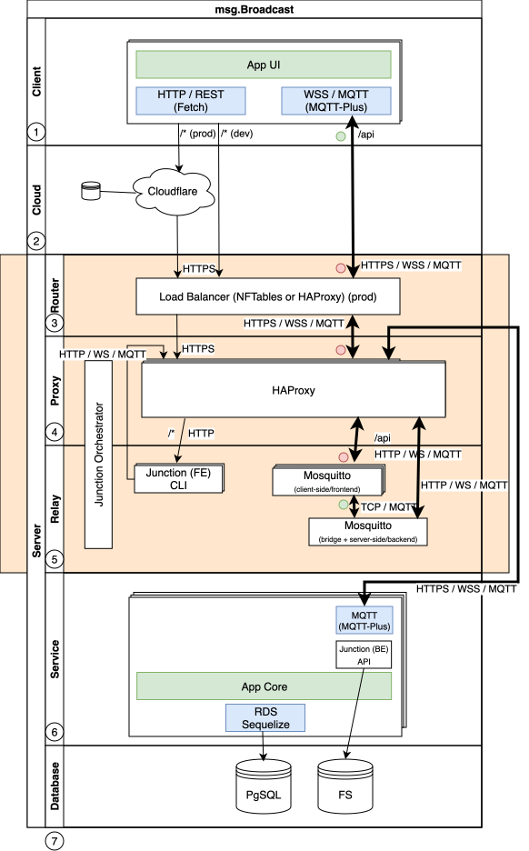

#   ARCH: Functionality View (FV)

##  COMPONENT: Web Client {{client}}

-   KIND:           Subsystem
-   REALIZES:       [[REQUIREMENT:name-appearance]], [[REQUIREMENT:browser-access]], [[REQUIREMENT:individual-url]], [[REQUIREMENT:user-consent]], [[REQUIREMENT:provider-switch]]
-   DEPENDS-ON:     [[COMPONENT:relay]]

The Vue.js single-page application renders the attendee and operator UI and drives all user interaction: it presents the
panel, attendee, studio, moderator, and manager screens, plays the video stream, and exchanges live data over MQTT,
BECAUSE msg.Broadcast delivers its entire experience in the browser.

##  COMPONENT: Client NLP {{client-nlp}}

-   KIND:           Module
-   PART-OF:        [[COMPONENT:client]]
-   REALIZES:       [[REQUIREMENT:client-sentiment]]

The client NLP module performs lightweight client-side sentiment analysis and language identification on attendee input
before it is sent, BECAUSE filtering at the source reduces server load and can prevent improper submissions.

##  COMPONENT: Router {{router}}

-   KIND:           Connector

The router (HAProxy with NFTables) routes incoming HTTP and WebSocket traffic across the proxy instances of an environment
using round-robin and separates the dev, QA, and production environments, BECAUSE traffic must be balanced and environments
isolated at the edge.

##  COMPONENT: Proxy {{proxy}}

-   KIND:           Connector
-   DEPENDS-ON:     [[COMPONENT:relay]]

The proxy layer (HAProxy) forwards the HTTP and WebSocket requests of a specific environment to the relay layer and scales
horizontally per environment, BECAUSE request handling must scale independently of the messaging layer.

##  COMPONENT: Relay {{relay}}

-   KIND:           Connector
-   DEPENDS-ON:     [[COMPONENT:service]]

The relay layer maintains thousands of bidirectional WebSocket/MQTT connections, brokering MQTT messages between clients
and the service layer and scaling horizontally, BECAUSE real-time fan-out to up to 10000 attendees is the central
performance challenge.

##  COMPONENT: Service {{service}}

-   KIND:           Service
-   REALIZES:       [[REQUIREMENT:questions]], [[REQUIREMENT:chat]], [[REQUIREMENT:moderation]], [[REQUIREMENT:forward-presenter]], [[REQUIREMENT:config-propagation]]
-   OWNS:           [[ENTITY:Event]], [[ENTITY:AgendaPoint]], [[ENTITY:Channel]], [[ENTITY:Resource]], [[ENTITY:ResourceProviderParam]], [[ENTITY:Role]], [[ENTITY:Message]], [[ENTITY:MessageText]], [[ENTITY:QuestionTag]]
-   PROVIDES:       [[INTERFACE:server-cli]]
-   DEPENDS-ON:     [[FV.database]]

The service layer executes all business logic for events, messages, authentication, and statistics: as the main server it
holds the event, moderation, access, and configuration logic, reacts to MQTT messages, and persists state, BECAUSE the
authoritative business rules must live in a single server tier.

##  COMPONENT: Authentication Service {{auth}}

-   KIND:           Module
-   PART-OF:        [[COMPONENT:service]]
-   REALIZES:       [[REQUIREMENT:authentication]], [[REQUIREMENT:parallel-access]], [[REQUIREMENT:automatic-url]]
-   OWNS:           [[ENTITY:User]], [[ENTITY:AuthorizationToken]], [[ENTITY:SessionToken]]
-   DEPENDS-ON:     [[FV.database]]

The authentication module issues and validates the authorization and session tokens: it generates one-time tokens, sends
them via the email gateway, validates logins, and enforces a single active session per user per event, BECAUSE
email-verified, single-session access is the core security mechanism.

##  COMPONENT: Translation Service {{translation}}

-   KIND:           Module
-   PART-OF:        [[COMPONENT:service]]
-   REALIZES:       [[REQUIREMENT:language-switch]]

The translation module produces language-specific message texts via an external LLM, translating them into the supported
languages on the fly while preserving the original, BECAUSE chat and questions must be available in both German and English.

##  COMPONENT: Statistics Service {{statistics}}

-   KIND:           Module
-   PART-OF:        [[COMPONENT:service]]
-   REALIZES:       [[REQUIREMENT:event-stats]], [[REQUIREMENT:debug-stats]], [[REQUIREMENT:channel-stats]], [[REQUIREMENT:user-stats]], [[REQUIREMENT:stats-snapshots]]
-   OWNS:           [[ENTITY:EventStatistic]], [[ENTITY:ChannelStatistic]], [[ENTITY:UserStatistic]]
-   DEPENDS-ON:     [[FV.database]]

The statistics module generates periodic event, channel, and user statistics snapshots, capturing cumulative counts of
tokens, sessions, connections, and viewers during a running event, BECAUSE trend dashboards require regular snapshots over
the event's lifetime.

##  COMPONENT: Junction Orchestrator {{junction}}

-   KIND:           Component
-   REALIZES:       [[REQUIREMENT:browser-access]]

The Junction component serves the static client bundle and orchestrates its delivery to the relay over MQTT+, BECAUSE the
client must be distributed alongside the same messaging infrastructure used for live data.

##  COMPONENT: Database {{database}}

-   KIND:           Component

The PostgreSQL database with the filesystem persists all business objects and static assets, storing all events, messages,
tokens, and statistics accessed through the Drizzle persistence layer, BECAUSE the authoritative, durable state of every
event must be persisted in one tier.
